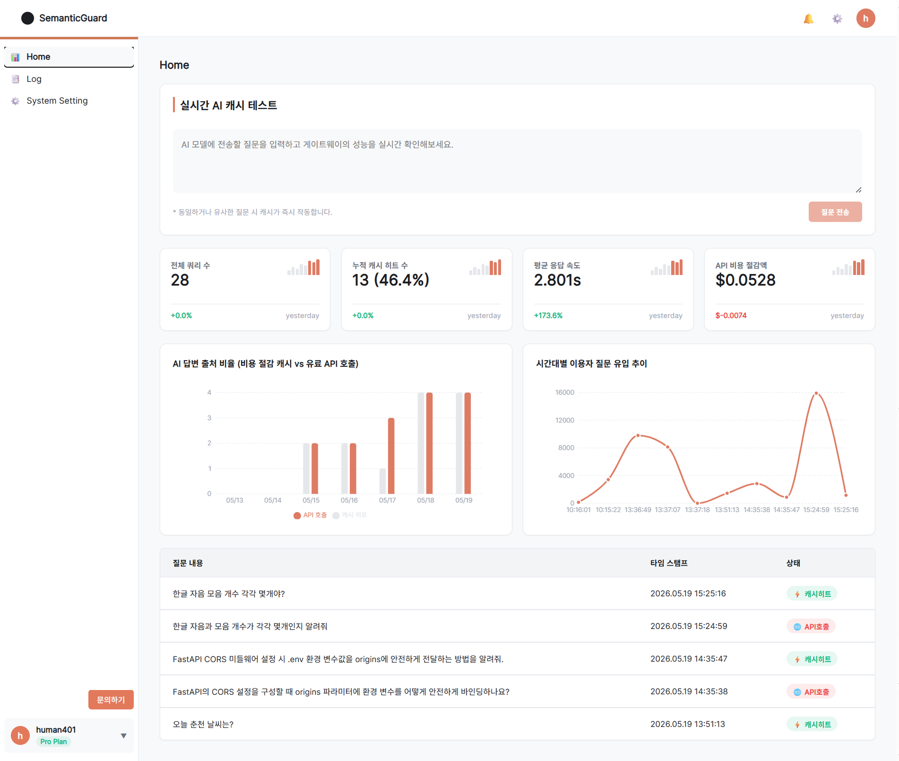
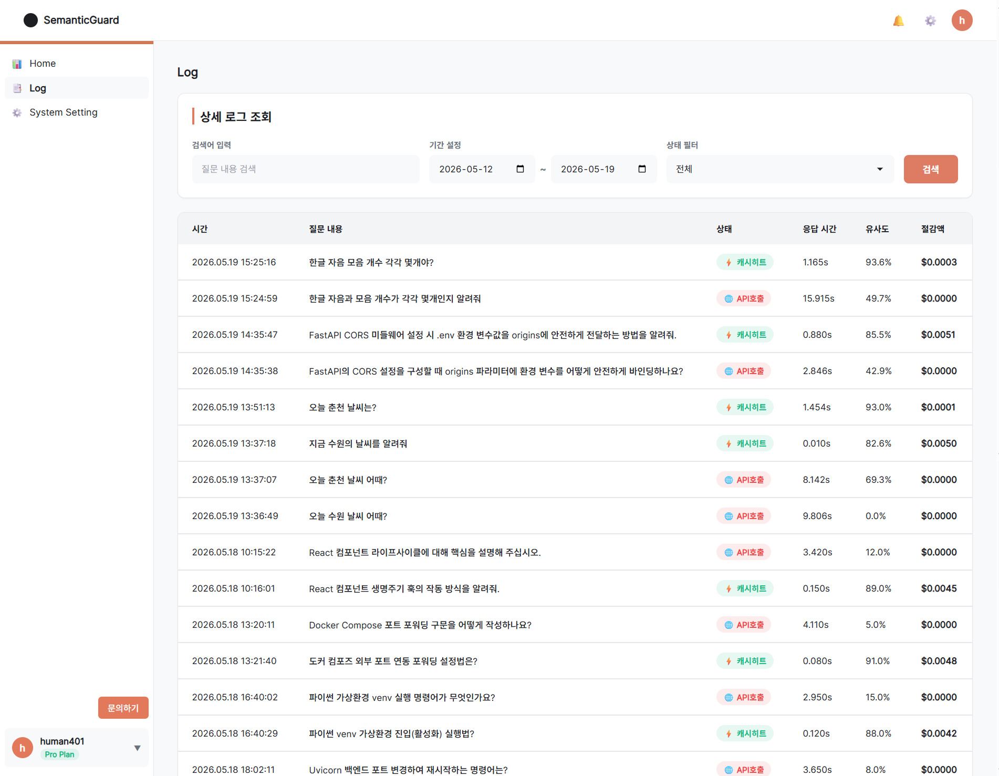
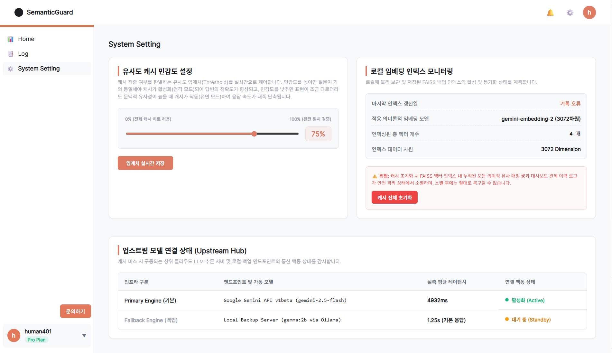

<div align="center">

# SemanticGuard

**의미론적 유사도 기반 AI 응답 캐싱 게이트웨이 플랫폼**

정확한 텍스트 매칭 한계를 넘어, 질문의 의도와 문맥을 분석하여 고비용/고지연 LLM API 호출을 최소화하는 지능형 프록시 게이트웨이입니다.

[](./frontend)
[](./backend)
[](https://github.com/facebookresearch/faiss)
[](https://github.com/langchain-ai/langgraph)

</div>

---

## 서비스 화면

| 📊 Home (대시보드) | 📑 Log (상세 이력) | ⚙️ System Setting (시스템 설정) |
|:---:|:---:|:---:|
|  |  |  |
| 실시간 캐시 적중률, 레이턴시 절감율 차트 및 쿼리 테스터 제공 | 최근 7일간의 캐시 검증 이력 필터링 및 상세 질문 텍스트 검색 | 캐시 민감도 임계치(Threshold) 제어 및 FAISS 인덱스 리셋 |

---

## 핵심 기능

| 기능 | 설명 |
|------|------|
| **지능형 의미론적 캐싱** | `gemini-embedding-2` 다국어 모델로 한국어 질문의 의도를 분석해, 형태가 달라도 의미가 유사하면 즉시 캐시 응답을 반환합니다. |
| **LangGraph 상태 제어** | 임베딩 ➡️ 캐시 검색 ➡️ (미스 시) 백엔드 LLM 호출 ➡️ 지표 산출의 전 과정을 LangGraph 상태 머신으로 안정되게 통제합니다. |
| **비동기 고성능 게이트웨이** | FastAPI 비동기 통신과 `run_in_threadpool`을 활용한 CPU-Bound 연산 분리로 동시 요청 처리 성능을 극대화합니다. |
| **비동기 파일 아카이빙** | `aiofiles` 기반의 파일 I/O 처리를 통해 대시보드의 실시간 통계 조회와 캐시 적적 시 입출력 병목 현상을 방지합니다. |
| **실시간 임계치 조정** | 설정 화면의 슬라이더 조정을 통해 캐시 적중의 민감도(Threshold)를 0%~100% 범위에서 실시간 동적으로 갱신합니다. |
| **SMTP 1:1 문의 연동** | 관리자에게 접수되는 메일 문의 시스템을 탑재하고, SMTP 계정 장애 시 자동 Mock 우회 설계를 적용했습니다. |

---

## 기술 스택

### Frontend
* **Core**: React 18, Vite
* **State & Router**: React Router DOM v6
* **Visuals**: Recharts (실시간 트래픽 및 레이턴시 변화 추적)
* **Styling**: Vanilla CSS (sleek dark mode 테마)

### Backend
* **Web Framework**: FastAPI, Uvicorn, AnyIO
* **Orchestration**: LangGraph, LangChain Core
* **Embedding API**: Google GenAI SDK (gemini-embedding-2, 3072차원)
* **Vector Store**: FAISS (IndexFlatL2)
* **Concurrency Utilities**: aiofiles, Starlette Concurrency Threadpool

---

## 프로젝트 구조

```
SemanticGuard/
├── backend/                  # FastAPI 백엔드 게이트웨이
│   ├── main.py               # API 라우팅, 실시간 통계 산출 및 비동기 엔드포인트
│   ├── embedding.py          # Google GenAI SDK 기반 임베딩 및 정규화 체인
│   ├── vector_store.py       # FAISS IndexFlatL2 벡터 저장소 매핑 및 로컬 로더
│   ├── state_machine.py      # LangGraph 기반 캐싱 생명주기 제어 흐름
│   ├── Dockerfile
│   └── requirements.txt      # 최신 안정화 라이브러리 목록
├── frontend/                 # React (Vite) 모니터링 대시보드
│   ├── src/
│   │   ├── components/       # 헤더, 사이드바, 1:1 문의사항 모달 프레임
│   │   ├── pages/            # Dashboard(Home), Log, Settings(System Setting)
│   │   ├── services/         # Axios 기반 API 연동 클라이언트 (api.js)
│   │   └── App.jsx           # 라우팅 및 테마 진입점
│   ├── index.html
│   ├── package.json
│   └── vite.config.js
├── docker-compose.yml        # Docker 통합 배포용 파일
└── .env.example              # 환경 설정 템플릿
```

---

## 핵심 기술 구현

### LangGraph 캐시 분기 라우팅
유사도 검색 점수 결과를 바탕으로 캐시 적중 여부를 판별하여, 캐시 히트 시 즉시 응답 노드로 분기하고 미스 시 업스트림 LLM을 호출하는 상태 그래프를 구현했습니다.

```python
def route_cache(state: CacheState) -> str:
    """유사도 점수를 기준으로 캐시 히트/미스 분기 라우팅"""
    score = state.get("similarity_score", 0.0)
    threshold = state.get("threshold", 0.75)
    
    if score >= threshold:
        return "calculate_metrics"
    else:
        return "call_backend"
```

---

## 트러블슈팅 요약
시스템 개발 및 실전 고도화 과정에서 분석하고 예방 조치한 기술적 문제 해결(Troubleshooting) 핵심 요약입니다.

* **LangGraph KeyError: `__start__` 해결**: 라이브러리 간 버전 불일치를 확인하고 코어 패키지 버전을 정합성 있게 상향 조정하여 해결.
* **한국어 지명 유사도 인식 및 0벡터 오염 해소**: `gemini-embedding-2` API(3072차원)로 업그레이드하여 형태소가 다른 지명의 혼동을 제거하고, 0벡터 발생 시 시스템 다운 방지 로직 구축.
* **이벤트 루프 대기 해결**: FAISS/LangGraph 연산을 `run_in_threadpool`로 할당하여 FastAPI 스레드가 고착되는 현상 해결.
* **디스크 동시성 병목 방지**: `logs.json` 입출력 시 `aiofiles` 비동기 스트림을 도입하여 대시보드 리로드렉 제거.

## Docker Compose 배포 방법 (Nginx 정적 서빙)

Docker Compose를 활용하여 컨테이너 환경에서 전체 서비스를 가동하는 절차입니다. 프론트엔드는 Nginx를 통해 80번 포트로 안전하게 서빙됩니다.

### 1. 환경 설정 (.env)
로컬 루트 디렉토리에 `.env` 파일을 생성하고 구글 Gemini API Key 및 필요한 계정 정보를 기입합니다. (동일하게 백엔드 컨테이너에 주입됩니다.)
```bash
cp .env.example .env
```

### 2. 컨테이너 빌드 및 백그라운드 실행
```bash
docker-compose up --build -d
```

### 3. 접속 주소 정보
* **프론트엔드 관제 대시보드 (Nginx 서빙)**: `http://localhost` (80번 포트)
* **백엔드 게이트웨이 API 및 Swagger Docs**: `http://localhost:8000/docs`

---

## 로컬 실행 방법

### 사전 요구사항
* Node.js 18+
* Python 3.10+
* Google Gemini API Key

### 1. 저장소 클론 및 환경 설정
```bash
git clone https://github.com/sssnyyyn/SemanticGuard.git
cd SemanticGuard
cp .env.example .env
```

### 2. 백엔드 실행
```bash
cd backend
pip install -r requirements.txt
python -m uvicorn main:app --reload --port 8000
```
* **백엔드 API 문서**: `http://localhost:8000/docs`

### 3. 프론트엔드 실행
```bash
cd ../frontend
npm install
npm run dev
```
* **프론트엔드 대시보드**: `http://localhost:5173`

---

**보좌관 자비스 기안 및 실행.**
